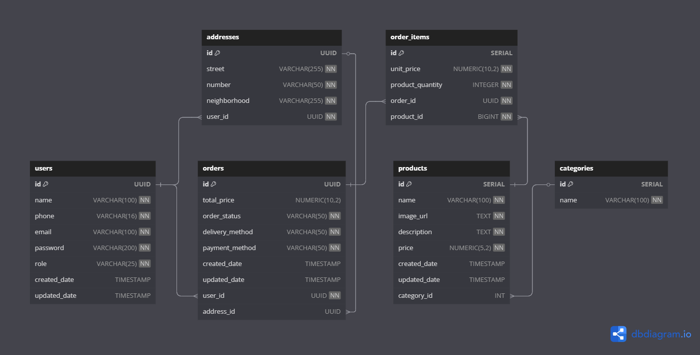
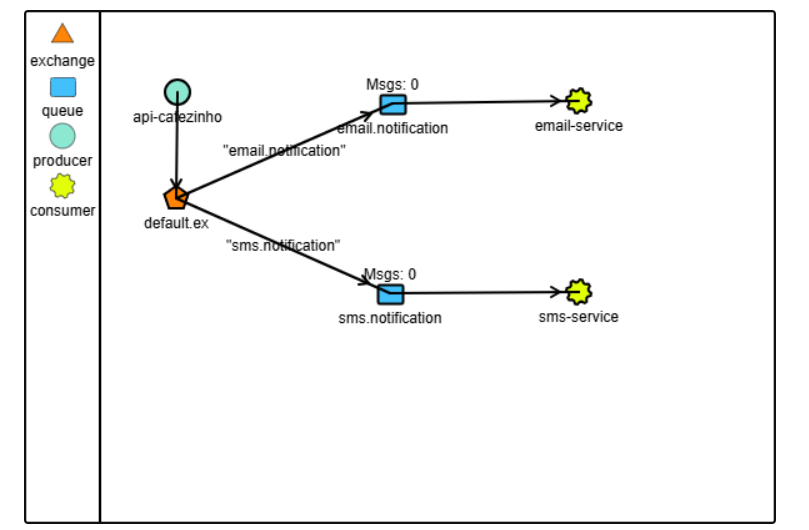

<h1 align="center">
  Cafézinho
</h1>

## Descrição

- Sistema para gerenciamento de um café, com integração a dois microsserviços responsáveis por comunicação com o cliente:
    - **email-service**: envia e-mails de boas-vindas via SMTP (Gmail)
    - **sms-service**: envia SMS com atualizações de pedido via AWS SNS (Simple Notification Service)

## Fluxo dos Microsserviços
1. O usuário é criado.
2. Um e-mail de boas-vindas é enviado (**email-service**).
3. Um pedido é criado pelo usuário.
4. O status do pedido é atualizado pelo admin.
5. Um SMS é enviado ao usuário com a atualização do pedido (**sms-service**).

<details>
    <summary><b>Exemplo: Email enviado.</b></summary>
    
</details>
<details>
    <summary><b>Exemplo: SMS enviado.</b></summary>
    
</details>

## Tecnologias
- **Linguagem**: Java
- **Framework**: Spring Boot
- **Gerenciador de Dependências**: Maven
- **Banco de Dados**: PostgreSQL
- **Migrations**: Flyway
- **Conversão de Objetos**: Mapstruct
- **Anotações**: Lombok
- **Autenticação**: JWT (JSON Web Token)
- **Testes Unitários**: JUnit e Mockito
- **Mensageria**: RabbitMQ
- **Broker na Nuvem**: Cloud AMQP
- **Serviço de SMS**: Amazon SNS
- **Serviço de E-mail**: SMTP Gmail
- **Documentação**: SwaggerUI

## Diagramas
<details>
    <summary><b>Diagrama ER</b></summary>
    
</details>
<details>
    <summary><b>Diagrama de Mensageria</b></summary>
    
</details>

## Endpoints
Documentação _Local_: http://localhost:8080/swagger-ui/index.html

## Configuração e Execução
Pré-requisitos: Java 17 e Maven

1. clone o repositório
2. acesse o diretório do projeto
3. configure o banco de dados no application.yml
4. configure os dados de acesso ao RabbitMQ (Cloud AMQP)
5. configure as credenciais do AWS
6. configure as credenciais do servidor de e-mail (SMTP Gmail)

```bash
# instale as dependências do Maven
mvn clean install

# execute a aplicação
mvn spring-boot:run

# pressione (ctrl + c) para encerrar a aplicação
```

## Autor

- Projeto desenvolvido por [Isabel Henrique](https://www.linkedin.com/in/isabel-henrique/)
- Fique à vontade para contribuir!
